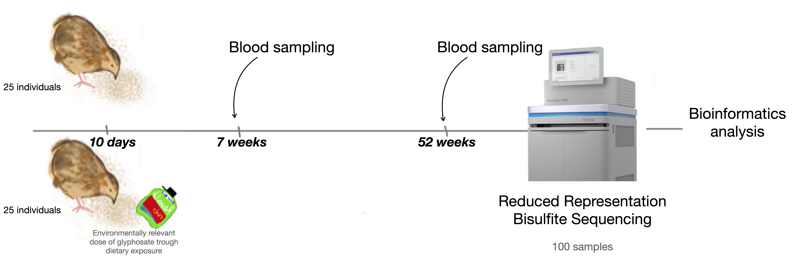
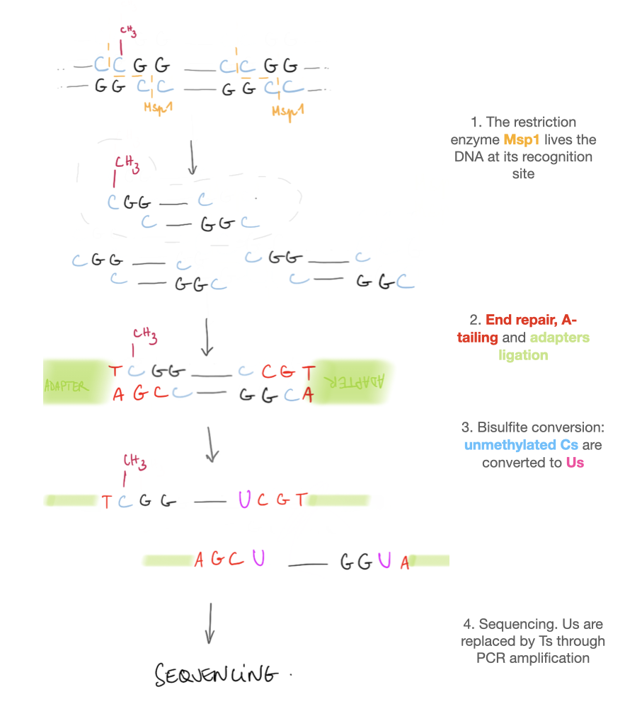
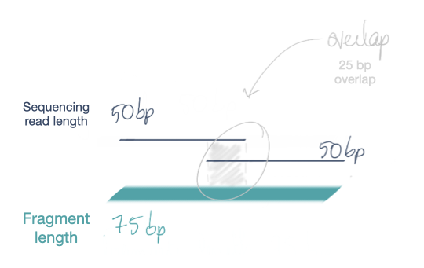
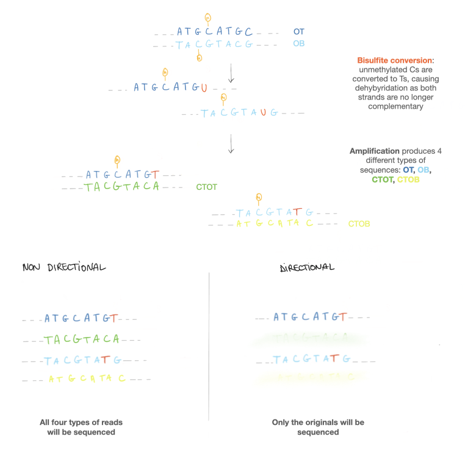

# Analyzing RRBS samples

### Context
Epigenetics commonly refers to the study of heritable phenotype changes that do not involve alterations in the DNA sequence. Epigenetics mechanisms arise from environmental conditions, development, aging, drug, chemicals, or even diet. Among epigenetic mechanisms, DNA methylation is the most studied one. Cytosine methylation has been shown to be implied in several biological processes, such as regulation of genes expression, development, X chromosome inactivation but also cancers.  

Recently, interest emerged for the potential effects of Glyphosate-Based-Herbicides (GBHs) on the epigenome to explain their mechanism of action on non-target organisms.
Ruuskanen et al. conducted a long-term exposure experiment using an environmentally relevant dose (Ruuskanen, Rainio, Gómez-Gallego, et al., 2020a) to unveil the cumulative effects and chronic exposure of GBHs on a bird species. Japanese quails were exposed to dietary GBHs (RoundUp Flex embedded within organic food), with concentrations below the No-Adverse-Effect-Level (NOAEL) from 10 days after hatching to 52 weeks old. Fifty chicks were randomly distributed into two groups where they were either fed with GBH contaminated food or control food. 
###### Experimental design, Ruuskanen et al. 2020

We here investigate whether long-term exposure to dietary GBHs affects DNA methylation patterns on a genome-wide scale in Coturnix japonica at two different time points.

The goal of this handbook is to provide a comprehensive document of the methods that were used throughout the analysis of the Ruuskanen et al. data. 

### How to analyze DNA methylation? 
Currently, sequencing methods are not able to differentiate methylated from non-methylated nucleotides. However, several methods to analyze DNA methylation exist, and choosing the right method will depend on the biological questions asked, among several other factors. For example, what is the aim of the study: is one trying to investigate de novo epigenetics changes or study already known methylation sites? What kind of samples will you be working with, in what quantity? What are the accuracy and robustness required?

The aim of the study for which the methods are presented here was to identify long-term glyphosate exposure effects on DNA methylation patterns on a bird species, *Coturnix japonica*. The goal was to assess if glyphosate had any effect on DNA methylation at the whole genome level at first and eventually identify biological pathways that could be impacted. For that matter, we needed to identify differentially methylated regions or sites across the genomes and to assess **DNA methylation at a single nucleotide resolution**. Bisulfite sequencing is currently the "gold-standard" method.

#### Bisulfite sequencing
Bisulfite sequencing consists in treating DNA with bisulfite salt before high-throughput sequencing. It converts unmethylated cytosines into uracils, which are further converted into thymines through PCR amplification. By comparing the converted DNA to the original sequence, one is able to determine the methylation state of a single cytosine. 
Two options exist to analyze DNA methylation at a single site scale using bisulfite conversion: Whole Genome Bisulfite Sequencing (WGBS) or Reduced Representation Bisulfite Sequencing (RRBS).  
While WGBS will target the entire genome, the second method will only focus on "CpGs islands," genomic regions with high CpG dinucleotides frequencies, where most cytosine methylation occurs. To enrich samples with CpG rich segments, DNA is first digested with the restriction enzyme Msp1, which cleaves DNA at the recognition sites 5'C^CGG'3, allowing every fragment produced by MspI digestion to contain DNA methylation information for at least one CpG. This method allows lowering the sequencing effort and cost while still retaining most of the cytosines methylation sites. 
###### RRBS sequencing

#### Single-end or paired-end reading? 
Sequencing can be single or paired-end. With single-end reading, the fragment will be read from only one end to the other, whereas in paired-end reading, the fragment will be read from both ends. Depending on the sequencing read length and the fragment length, paired-end reading will yield redundant information from the overlapping reading part.
Paired-end reads will lead to a greater mapping efficiency and are more effective than single-end reads for locating especially repetitive sequences back to the genome. However, in the case of bisulfite sequencing, paired-end sequencing will overrepresent methylation sites from the overlapping part. For that matter, single-end reads will give more accurate information as long as the read length allows a proper mapping efficiency. 
###### paired-end reading

#### directional or non directional?
A bisulfite-treated library can be directional or non-directional depending on the PCR amplification protocol. 
As the bisulfite treatment only affects cytosines, it produces non-complementary strands causing the dehydration of the sequence. Therefore, PCR amplification of one bisulfite-treated sequence can yield four different forms of reads: a copy of the top, a copy of the bottom, and a copy of each of their complementary.
If the library is directional, only the top and the bottom strand will be sequenced, whereas if the library is non-directional, all four forms will be sequenced.
The original copies and their complementary both yield methylation information for the same strand. Therefore, non-directional libraries are highly redundant. 
Bisulfite treated libraries are most often directional
###### directional and non directional libraries

### methods applied for this study
To highlight and compare methylation patterns, DNA was therefore sequenced using RRBS producing single-read directional libraries.

## Sequence alignment and methylation call

### Quality control 
Before analyzing the sequencing product, it is essential to do a quality control (QC) check of the raw data. A QC should determine beforehand any sequencing bias, such as biases in base composition, read duplication, base quality, and read length. It will help decide if the reads are of good quality enough to be processed in further analysis. 

A QC was performed on the RRBS raw data with FastQC (v0.11.9), a very popular quality control tool for high throughput sequence data (Andrews S., 2010). By giving the programma fastq file, it will output an [html file presenting quality metrics of the raw reads](/files/fastqc_report.html).   
These metrics are:   

1. Quality scores across all bases
- Quality per tile
- Quality score distribution over all sequences
- Sequence content across all bases 
- GC distribution over all sequences.
- N content across all bases
- Distribution of sequence length overall sequences
- Sequences duplicates.
- Adapters sequences contamination.   
(plots can be seen [here](files/fastqcmetrics.md))

There is one HTML output per sequencing file. When running the QC on tens of files at once, looking at each one of the outputs is tedious. [MultiQC](https://multiqc.info) is a tool allowing to aggregate the results from bioinformatics analyses (such as QCs of fastq files) across many samples in [a single report](/files/multiqc_report.html). From this report, it is then easy to discriminate samples that have quality reports out of the average, and that should maybe be removed. 

### Trimming 
The QC will only help to troubleshoot samples. 
To actually improve the quality of the samples, technical sequences that remains and low-quality ends and reads should be removed. 
Trimming is an important step to ensure we work with data of the best quality possible because low-quality reads decrease the alignment confidence and lead to poor mapping efficiency. 
Bioinformatic tools such as cutadapt allow discarding low-quality reads/ends and technical leftovers from NGS. 
[Trim Galore!](https://www.bioinformatics.babraham.ac.uk/projects/trim_galore/) is a wrapper script that uses cutadapt and FastQC to apply quality and adapter trimming to FastQ files, with special care for MspI-digested RRBS. 
First, Trim Galore! will remove any low-quality base call from the 3' end.
Then, it removes any sequence adapters given, but it will use the first 13 bp of Illumina standard adapters ('AGATCGGAAGAGC') by default.
When given the `-rrbs` option, two additional bases from the 3' ends of adapters trimmed reads will be removed. It is to prevent methylation calls on the filled-in cytosine from end repair. 
Lastly, very short reads (shorter than 20bp or so) will be removed, as short sequences reduce mapping efficiency and lead to false sequence alignment.

In our experiment, sequencing resulted in 44,23 million reads per library on average, of which 44,18 remained after quality filtering. As reads were of good quality before trimming, read lengths after trimming were hardly affected.

An example of a trimming report can be accessed [here](/files/200022_36_48B_S37_L002_R1_001.fastq_trimming_report.txt).

### Alignment and methylation call 

The mapping of bisulfite-treated reads is challenging because of the loss of information induced by the bisulfite treatment converting unmethylated Cs into Ts, while unmethylated cytosines account for the vast majority of cytosine in a genome (~99% in the human genome). For that reason, classic short read mapping tools available cannot perform bisulfite-treated sequences alignment. 
To address this challenge, two types of bioinformatics tools exist. The first type of tool will allow asymmetric mapping between Ts from bisulfite-treated reads and Cs from the reference sequence (but not the opposite). 
To reduce complexity, the second type of tool will rely on a three letters alphabet alignment for an unbiased mapping.  
[Bismark](https://rawgit.com/FelixKrueger/Bismark/master/Docs/Bismark_User_Guide.html#bismark-alignment-and-methylation-call-report), the alignment tool and methylation extractor used for processing our data rely on that second strategy.
Cs remaining in sequence reads (i.e., methylated cytosines) are all converted to Ts on the forward strand, which is equivalent to a G to A conversion on the reverse strand.
The reference genome also goes through a C to T and a G to A conversion. Sequences producing one best alignment score are kept. The converted genome's sequences producing alignments are in the next step compare to the original reference genome's sequence to assess methylation state.

After the program finishes running, Bismark will produce a [report](/files/200022_36_48B_S37_L002_R1_001_trimmed_bismark_bt2_SE_report.txt) with a summary of the parameters used for the alignment, with various statistics from the alignment and a [methylation call report](/files/200022_36_48B_S37_L002_R1_001_trimmed_bismark_bt2_splitting_report.txt).

